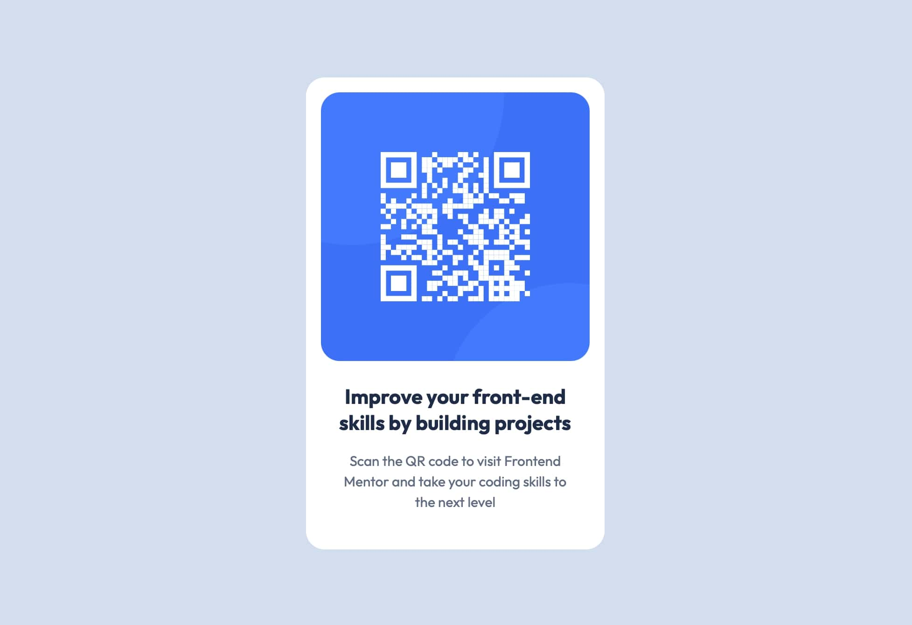

📌 Project Overview

This project is a simple QR code component built using HTML & CSS. The goal was to create a clean, responsive card design that displays a QR code, a heading, and a description while ensuring proper alignment and styling.

🛠 Technologies Used

HTML: For the structure of the QR code component.
CSS: For styling, layout, and responsiveness.

📷 Project Preview

🎯 Project Process

1️⃣ Planning & Setup
Defined the project goal: Creating a centered QR code card.
Created the necessary files: index.html and style.css.
Structured the HTML with a <main> container, an image, a heading, and a paragraph.

2️⃣ Styling & Layout
CSS Reset: Applied a basic reset to remove default browser styles.
Design System: Defined CSS variables `(:root {})` for colors, font sizes, and spacing for maintainability.
Container Styling: Styled the `.container` with padding, background color, and border radius.
Typography: Used system fonts and adjusted font size, weight, and line height for readability.

3️⃣ Centering the Card
Set `height: 100vh; on <main>` to take up the full viewport.
Used Flexbox `(display: flex; justify-content: center; align-items: center;)` to align .container in the center.

4️⃣ Debugging & Refinement
Fixed a typo in CSS variable `(--clr-card-backgroung → --clr-card-background)`.
Adjusted font size values to use the correct variables.
Optimized padding and margin to remove redundant styles.

5️⃣ Final Touches & Testing
Tested the design in different screen sizes using DevTools.
Ensured consistent spacing and alignment across elements.
Cleaned up unnecessary comments and code.

📚 What I Learned from This Project
This project helped me gain a better understanding of HTML & CSS fundamentals, as well as how to structure and style a simple component effectively. Here are some key takeaways:

1️⃣ Structuring HTML Properly
How to create a semantic and organized HTML structure using <main>, 
, , <h1>, and 
.
The importance of using meaningful class names to make styling easier.

2️⃣ Using CSS for Layout & Styling
How to apply a CSS Reset to ensure consistency across browsers.
The benefits of using a design system with CSS variables `(:root {})` to make styles reusable.
How to properly style a container with padding, margins, background colors, and rounded corners.

3️⃣ Centering Elements with Flexbox
The best way to center a card vertically and horizontally using display: flex; justify-content: center; align-items: center;.
How height: 100vh; on <main> helps the container take up the full screen height.

4️⃣ Debugging & Refinement
The importance of checking for typos `(like --clr-card-backgroung instead of --clr-card-background)`.
How to use correct variable names in CSS `(font-size should use --fs-heading, not --fw-heading)`.
How to optimize padding and margins to avoid unnecessary styles.

5️⃣ Testing & Final Touches
How to use DevTools to check how the design looks on different screen sizes.
The importance of cleaning up unused CSS properties and comments for readability.
How to structure a README file to document my project properly.

🚀 Next Steps
Explore CSS Grid for layout alternatives.
Improve responsiveness for different screen sizes.
Add hover effects to make the design more interactive.
